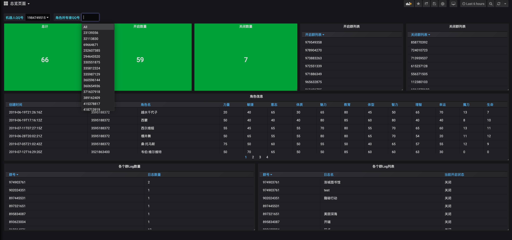
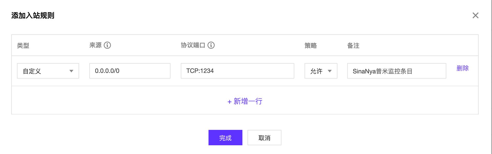
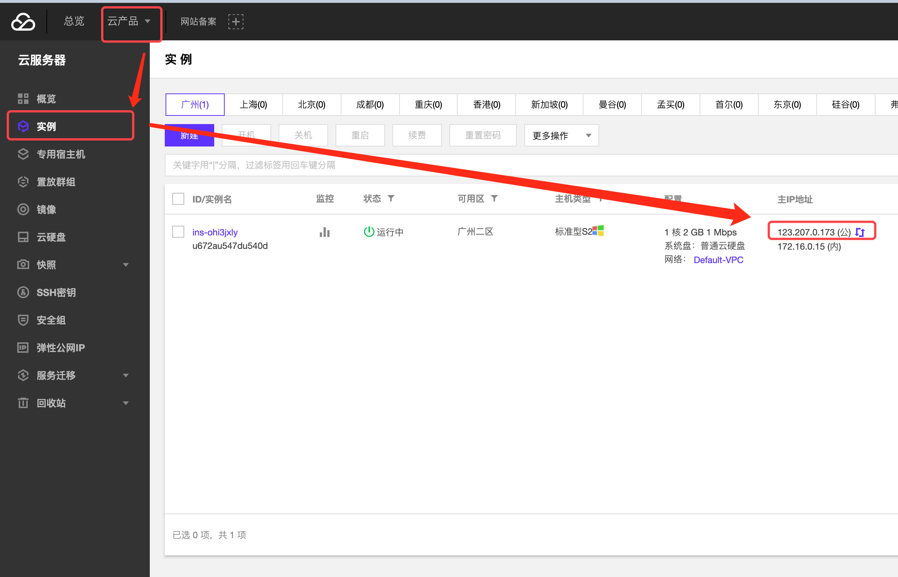
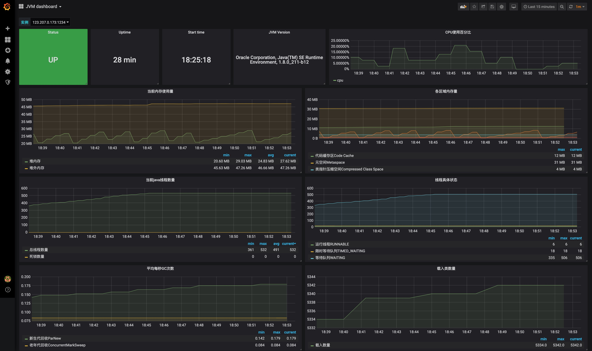

# 除了一个能用的骰子外，我还想要更多

目前仅提供一项附加功能:

额外监控与展示平台:[http://123.207.150.160:3000](http://123.207.150.160:3000)

此平台分两部分提供支持

## 用户总览

首先看左上角两个下拉框，分别是当前使用SinaNya核心的骰娘QQ号。各位骰主可以选择此QQ号，第一行将显示

* 总计加入群
* 当前开启群数量\(即bot on数量\)
* 当前关闭群数量\(即bot off\)
* 当前开启群列表
* 当前关闭群列表

> 这些信息，是具体到左上方选择的某一个骰娘的

继续向下看两行

* 角色信息
* 各个群Log数量
* 各个群Log开启列表

> 这些信息，是所有骰娘共享的

## 骰娘健康程度页面

这个界面是提供给使用服务器的骰主的，使用个人PC的骰主不建议继续向下看。

### 准备工作

这个页面使用之前需要你额外做一些准备工作:

#### 登陆你的云服务器管理界面，这里以腾讯云为例

#### 添加以下规则条目

#### 点击确定后，查看主机公网IP

#### 报备

加入群`162279609`向群主提供这个IP并说明来意即可

### 使用界面

包含了

* 骰子服务状态（SinaNya）
* 开启时间
* 开启时间
* 主机CPU占比
* 内存使用量
* 线程使用量
* 垃圾回收情况

这些信息可以用来判断你骰娘的服务状态，譬如:

* 当前压力
* 程序是否有bug
* 程序在之后的时间内是否还会稳定
* 如果程序可能存在bug的话，大概多久之后会出现宕机

> 这个界面只需要报备一次即可，无论你之后是否修改代码和配置文件，都不需要再重新报备了。

