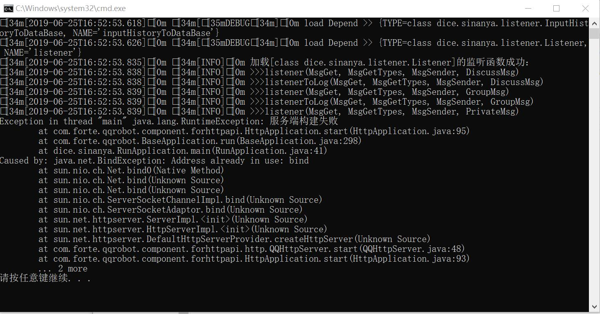
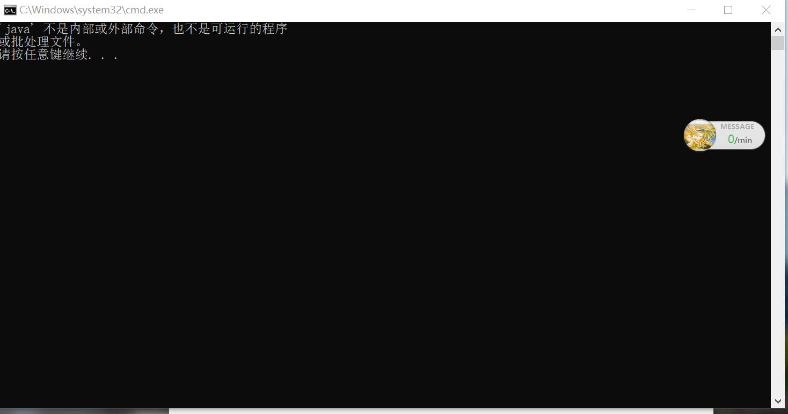
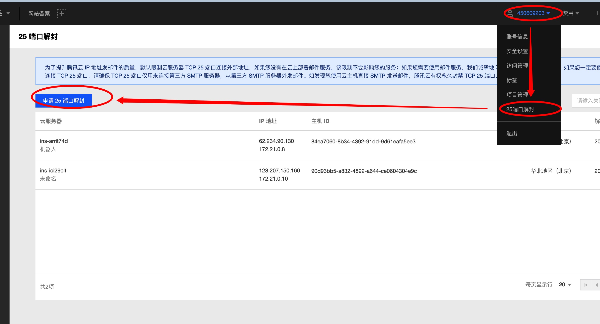

# 我遇到了一些问题！

## 我下载了文件，但我打不开它

这里使用Maven打包，因此生成的是`SinaNya.tar.gz`文件，你可以将它理解为一种**2层嵌套的压缩文件。**解压一次后得到`SinaNya.tar`文件，再用winrar之类的软件把这个文件解压后即可得到项目文件夹。

## 我如何把文件传到服务器上去呢？

你可以用百度网盘，也可以直接复制粘贴（假如你使用的软件支持的话）。实在不行还可以直接从服务器上打开网页下载嘛~

如果你使用的是Linux，那么你可以使用wget命令，具体使用方式稍加百度即可

如果你比较熟悉Linux，那么本项目使用Maven进行Build，你的`SinaNya.tar.gz`会生成在target目录下，可以直接使用

## 我这里报错为:服务器构建失败！

返回你的HttpApi插件配置界面，查找`localhost`后的端口，必须和你`sinanya.properties`配置文件中的javaPort一致

## 我这里报错为:'java'不是内部或外部命令，也不是可运行的程序

请参见教程的JDK安装部分并重新安装JDK

## 我的邮件发不出去！

由于云服务商会封禁邮件的25端口，邮件会发送失败

可以通过如下方式开启，这里以腾讯云为例

不过据我所知，阿里云的25端口解封有些繁琐，我也没用过请自行研究

> 值得注意的是，即使这里没有解决仍然不影响你使用本核心。邮件发不出去的话，你可以在服务目录的`SinaNya/saveLogs/<日志群>/<日志名>`找到你要的文件。而且发不出去不会影响任何其它功能！

