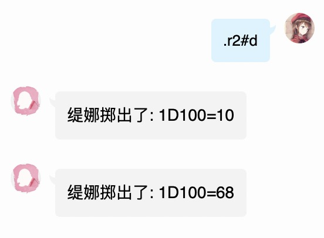
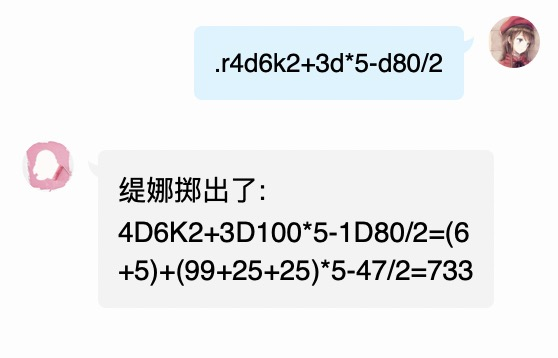
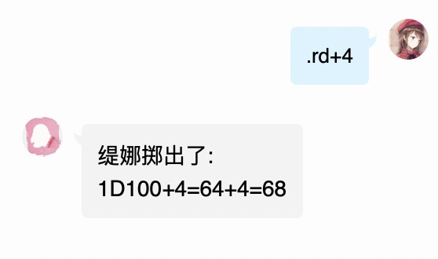
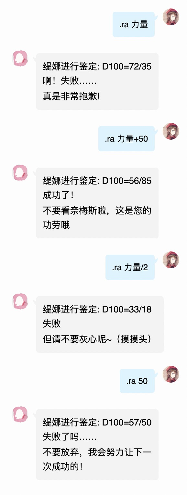
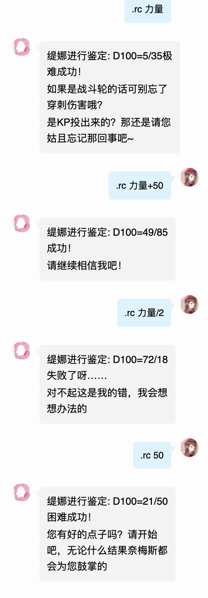
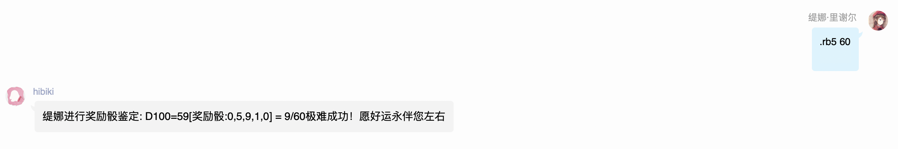
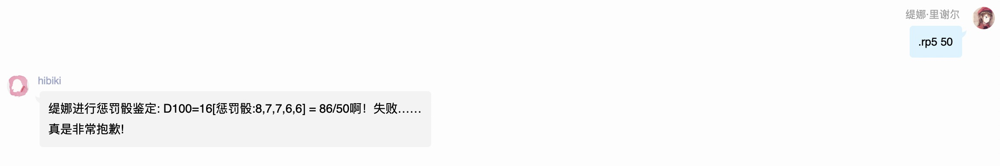
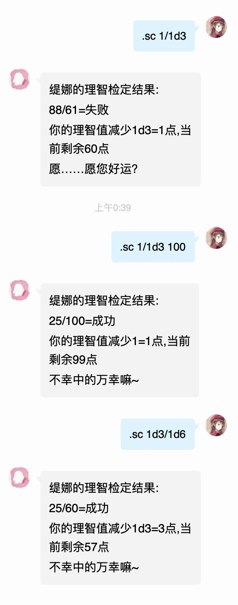
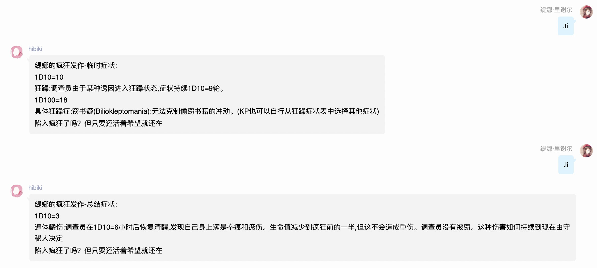

# 常用命令

.r

最基本的骰点功能，允许使用各种计算表达式，但不允许使用判定

## .ra

房规判定，允许技能值和技能名，允许简单的运算

## .rc

规则书判定，允许技能值和技能名，允许简单的运算

## .rb

奖励骰，紧跟的参数是奖励骰个数，空格后是技能值。当然，也可以不带技能

奖励骰计算方式为:骰1D100，再骰奖励骰个数个1D10-1。比较1D100的十位数，和1D10-1的值哪个小就作为1D100的十位数

## .rp

惩罚骰，紧跟的参数是惩罚骰个数，空格后是技能值。当然，也可以不带技能

惩罚骰计算方式为:骰1D100，再骰奖励骰个数个1D10-1。比较1D100的十位数，和1D10-1的值哪个大就作为1D100的十位数

## .sc

理智值检定，允许常规的理智值表达式，允许不带技能名调用人物卡信息

## .ti/li

疯狂症状获取

## .en

技能成长，由于本骰子强制使用多人物卡，因此在不设定人物卡的情况下会无法使用en命令

