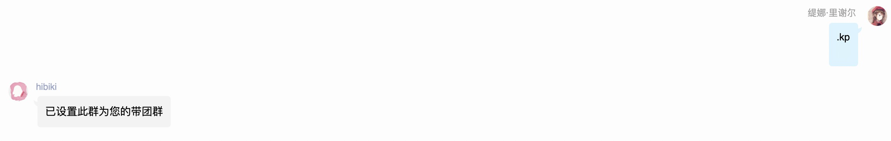
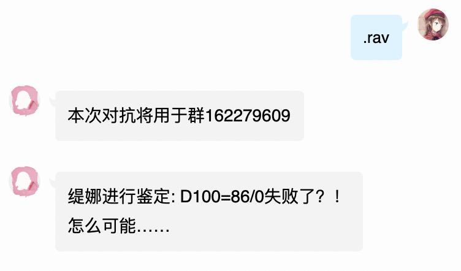
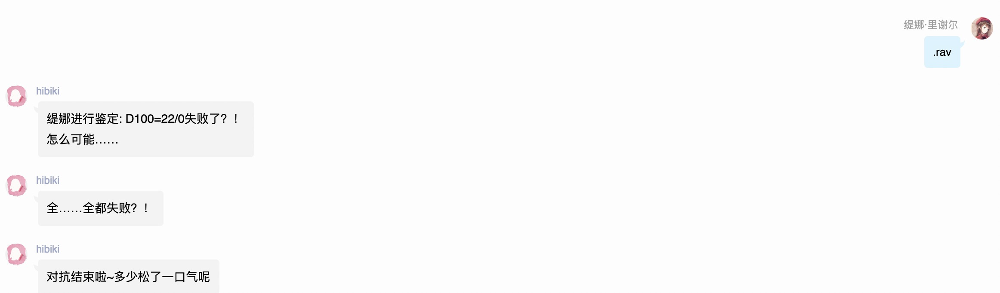
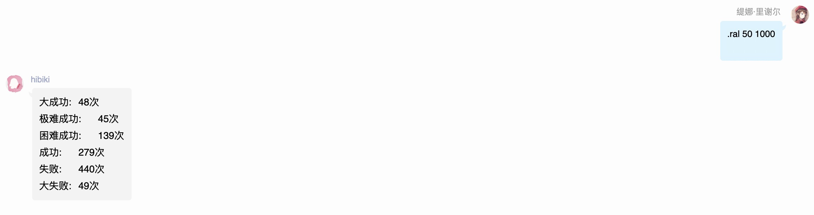

# 附加指令

## .kp

设定kp主群

## .rav

房规对抗

先在群中骰的视为先手，而后骰的视为后手。

群中使用.kp设定后，私聊骰子的视为在群中骰，这样可以隐藏NPC的技能值

骰娘将根据成功等级-&gt;骰点大小-&gt;技能上限的顺序进行比较，判断对抗胜负，返回先手或后手胜利。

骰点支持ra支持的所有规则

## .rcv

规则书对抗，与rav大同小异，这里不再做解释

## .ral

房规多重骰点，第一个参数是技能值，第二个次数是次数

本意是当需要多次技能检定时，可以方便的直接返回成功等级。

当然你也可以用它来测试是否灌铅？

目前来看ra房规的大成功，大失败几率都是5%。千次各自出50，成功失败对半分，这已经是很完美的数据了。

## .rcl

规则书多重骰点，和ral类似这里不再介绍

