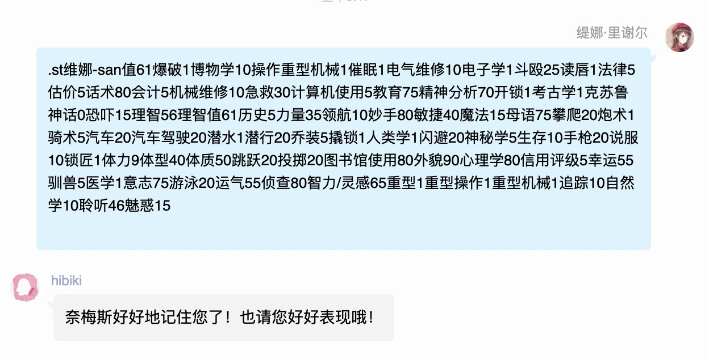
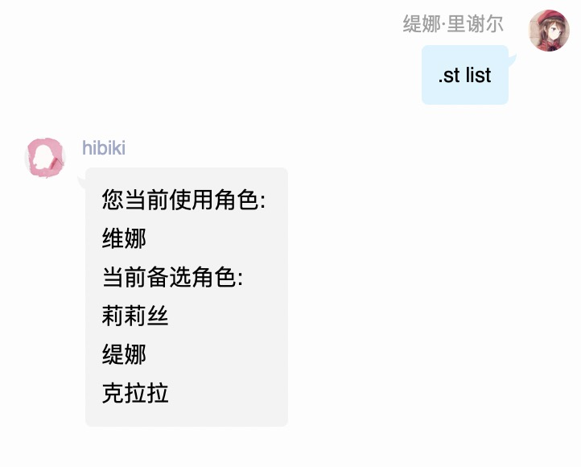
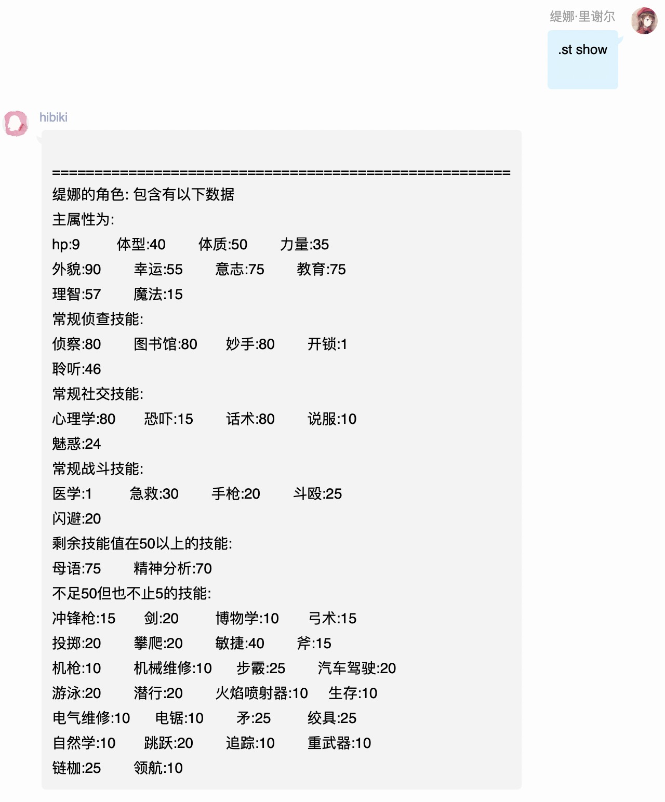

# 人物卡

## .st&lt;角色名&gt;-&lt;属性字符串&gt;

设定人物卡

## .st&lt;角色名&gt;-&lt;部分字符串&gt;

更新人物卡中部分技能，若人物卡不存在，则其它所有技能为默认值，属性默认为0

## .st list

查看人物卡

## .st&lt;角色&gt;

切换人物卡

## .st show

显示人物卡技能

## .st rm &lt;角色名&gt;

删除某张人物卡

