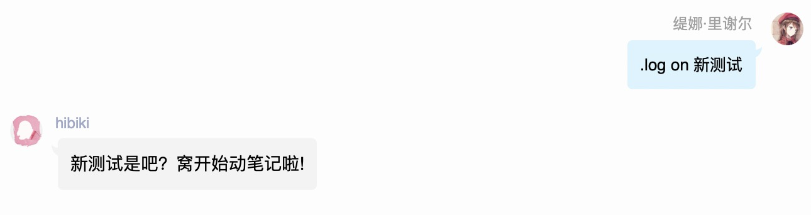
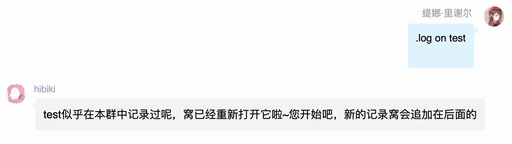
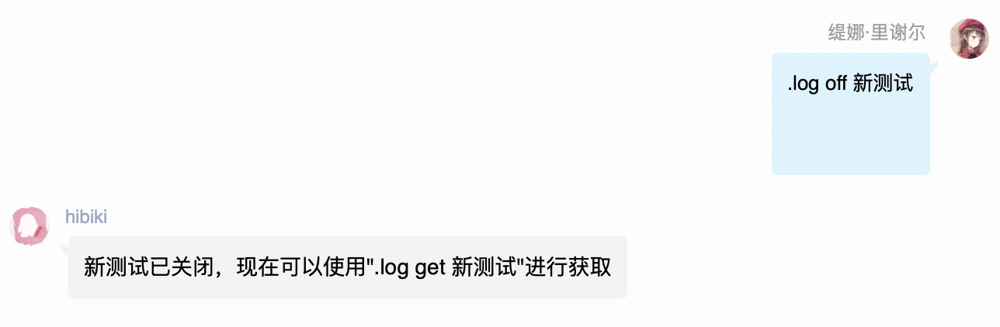
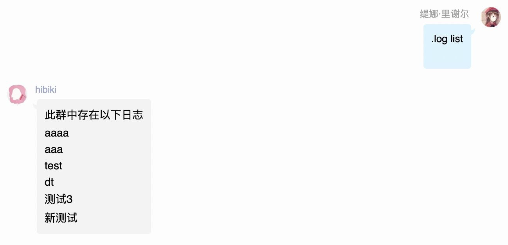
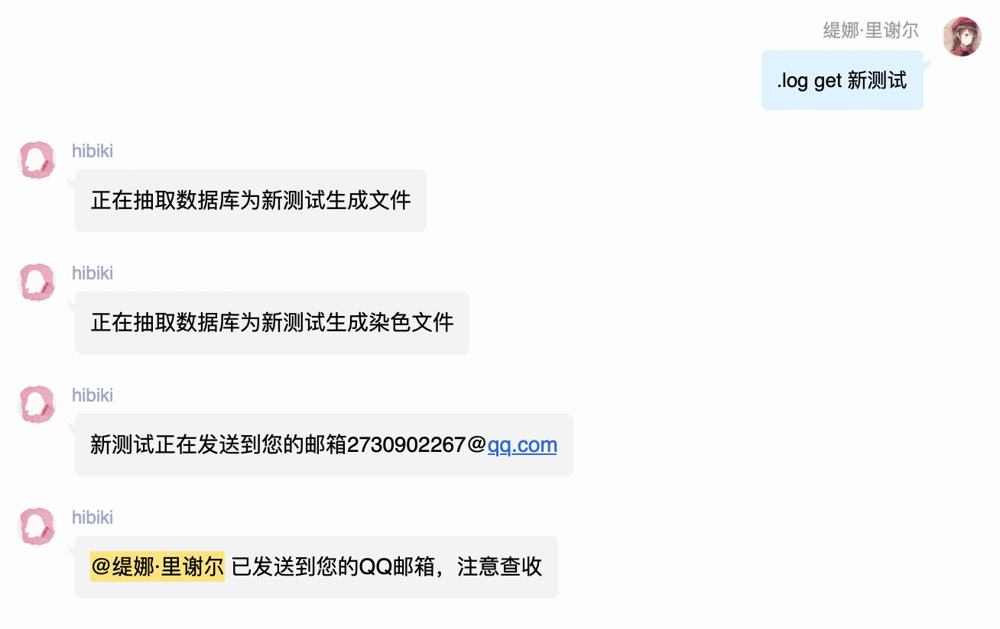
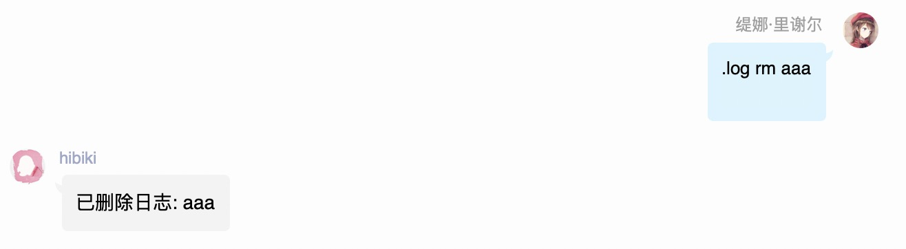

# 日志

## .log on &lt;日志名称&gt;

开启一个日志

* 如果日志不存在会创建
* 如果日志存在会在原记录上追加

同一时间一个群只能开启一个日志

## .log off &lt;日志名称&gt;

## .log list

查看本群内日志列表

## .log get &lt;日志名称&gt;

获取日志，会分为日志文件和染色文件两个文件发送，结果会发送到get人的QQ邮箱

* 日志文件:txt可以打开，包含了规整后的日志内容，会自动给玩家说话加“”并补全括号
* 染色文件:word可以打开，包含了过滤后的日志内容，不会包含（）内文件

## .log rm &lt;日志名称&gt;

删除日志，会永远删除日志的记录再也无法恢复

