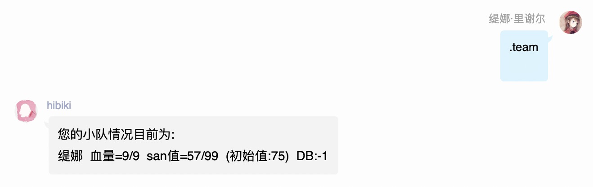
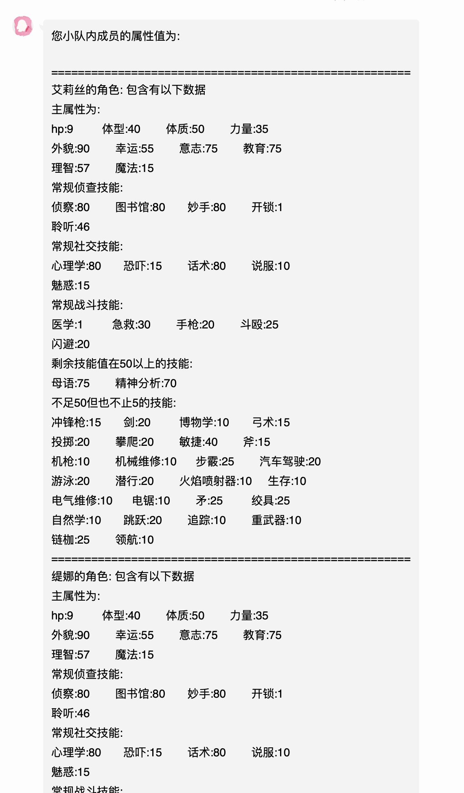
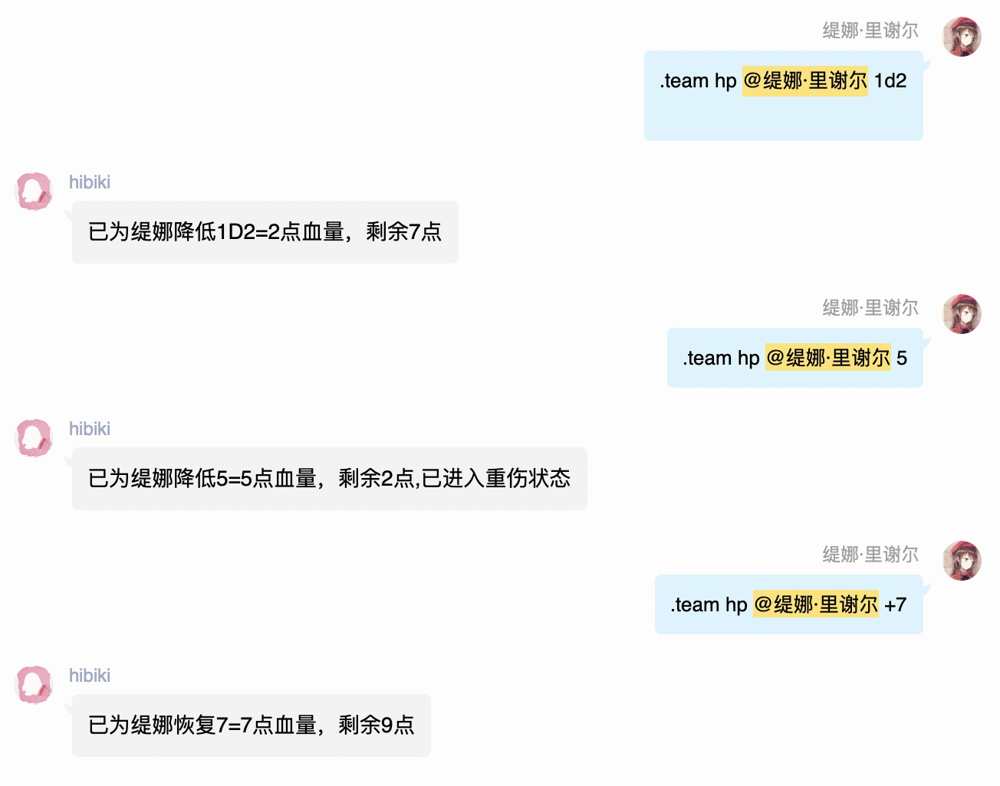
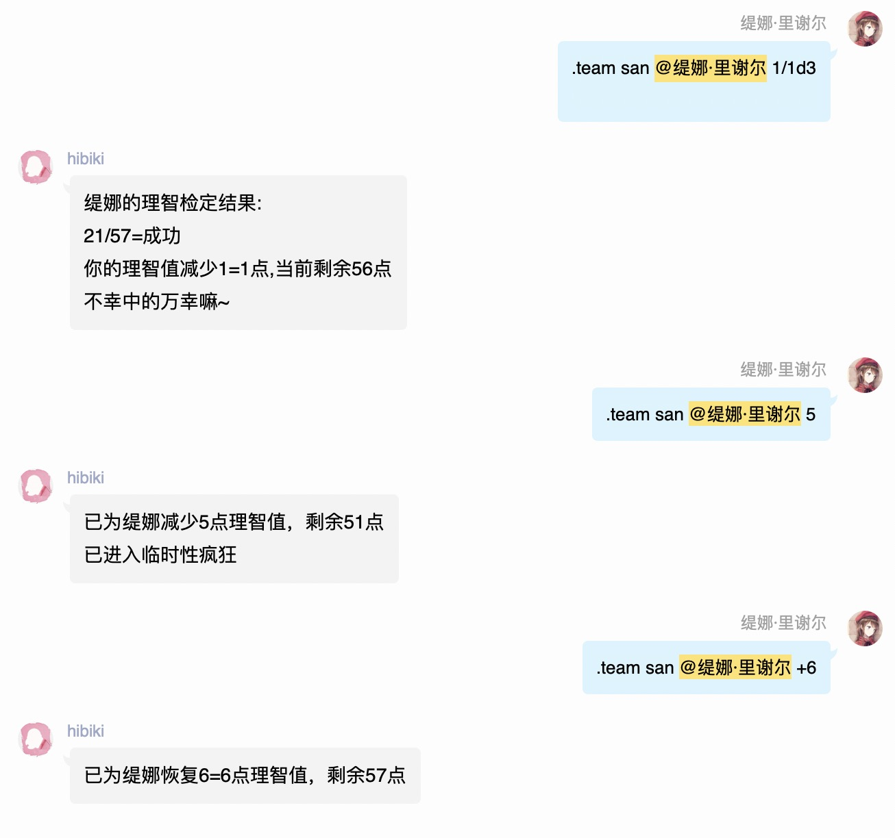
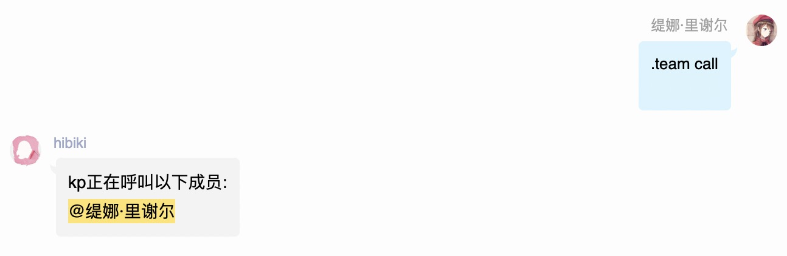
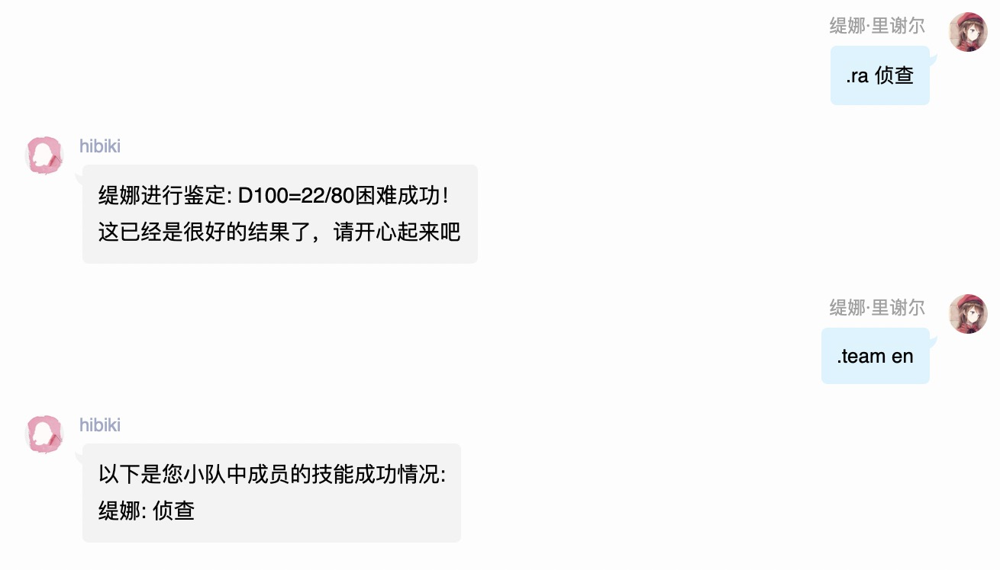
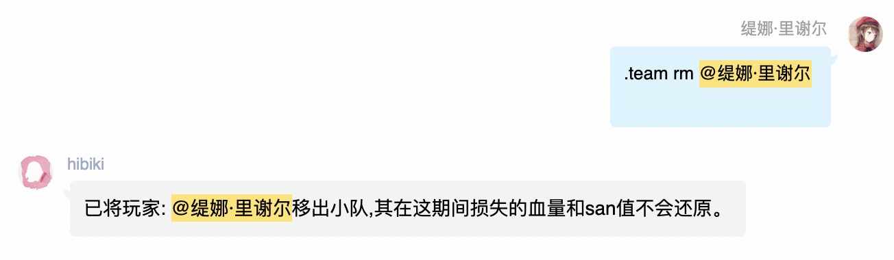
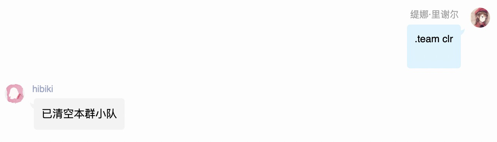

# 小队

## .team set @成员QQ @成员QQ2

将指定成员加入小队，可以@多个，会自动识别对方当前激活人物卡

## .team

查看小队内状态

## .team desc

查看小队内成员技能值

## .team hp @成员QQ 5

降低指定成员血量

* 可以使用表达式
* 可以使用+号表示恢复
* 可以@多个成员，会分别计算表达式

## .team san @成员QQ 1/1d3

降低指定成员理智值

* 可以使用表达式
* 可以使用+号表示恢复
* 可以@多个成员，会分别计算表达式

## .team call

呼叫小队内所有成员

## .team en

查看小队成员在（日志记录期间，详情查看日志章节）成功过的所有技能

## .team rm @成员QQ

将某人移出小队，这期间变更的属性不会恢复

## .team clr

清空小队

